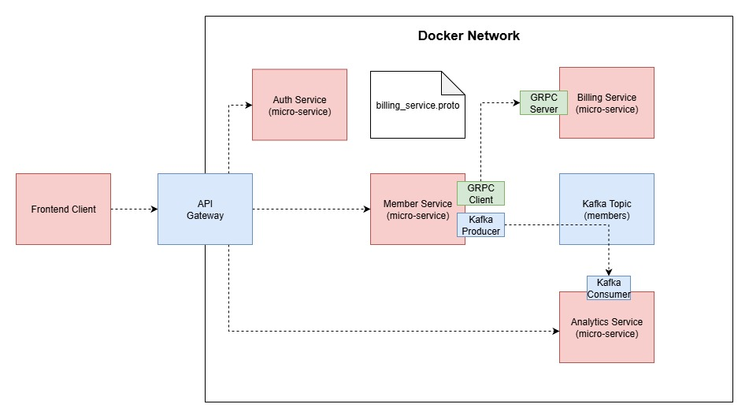
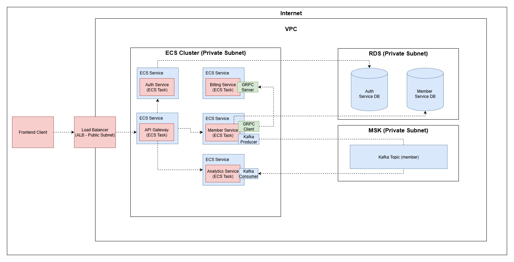

# Gym Management System

A production-ready Spring Boot microservices-based gym member management and billing system. This project demonstrates modern microservices architecture patterns including service discovery, API gateway, gRPC inter-service communication, event-driven messaging with Kafka, and cloud-ready deployment.

## System Architecture

### Development Architecture (Docker Network)



### Production Architecture (AWS)




##  Services Overview

### Auth Service
**Purpose**: Centralized authentication and authorization  
**Port**: `4005`  
**Database**: PostgreSQL (`auth_db`)

**Features**:
- JWT-based authentication
- User registration and login
- Token validation and refresh
- Role-based access control (RBAC)
- Password hashing with BCrypt


---

### Member Service
**Purpose**: Member profile and membership management  
**Port**: `4000`   
**Database**: PostgreSQL (`member_db`)

**Features**:
- CRUD operations for member profiles
- Membership status tracking (ACTIVE, EXPIRED, SUSPENDED)
- Publishes events to Kafka on member registration
- Exposes gRPC endpoints for member validation
- Member eligibility verification

**Event Publishing**:
- `member.registered` - Published when new member joins

**gRPC Services**:
- `ValidateMember` - Validates member ID and membership status
- `GetMemberDetails` - Retrieves member information for billing


---

### Billing Service
**Purpose**: Membership billing and payment processing  
**Port**: `4001`   


**Features**:
- Membership payment processing
- Member validation via gRPC before processing payments


**gRPC Client**:
- Calls Member Service to validate member status before processing payments
- Verifies membership is active before billing

---

### Analytics Service
**Purpose**: Member registration analytics and reporting  
**Port**: `4002`

**Features**:
- Consumes member registration events from Kafka
- Tracks member registration metrics


**Event Consumption**:
- Consumes from `member-events` Kafka topic
- Processes `member.registered` events for analytics

---

### API Gateway
**Purpose**: Single entry point and request routing  
**Port**: `4004` 

**Features**:
- Centralized request routing to microservices
- Authentication validation via Auth Service
- CORS configuration
- Circuit breaker integration (Resilience4j)


##  Tech Stack

### Backend Framework
- **Spring Boot**: 3.5.1
- **Java**: 21
- **Maven**: Build and dependency management

### Microservices Infrastructure
- **Spring Cloud Gateway**: API Gateway
- **Spring Cloud Netflix Eureka**: Service discovery (optional)

### Communication Patterns
- **gRPC**: Synchronous inter-service communication (Billing ↔ Member)
- **Apache Kafka**: Asynchronous event-driven messaging (Member → Analytics)
- **REST**: External API endpoints

### Data & Persistence
- **PostgreSQL**: Relational database (separate DB per service)
- **Spring Data JPA**: ORM and data access
- **Hibernate**: JPA implementation
- **HikariCP**: Connection pooling

### Security
- **Spring Security**: Authentication and authorization
- **JWT (JSON Web Tokens)**: Stateless authentication
- **BCrypt**: Password hashing

### DevOps & Infrastructure
- **Docker**: Containerization
- **Docker Compose**: Local multi-container orchestration
- **AWS ECS**: Container orchestration on AWS (production)
- **AWS RDS**: Managed PostgreSQL (production)
- **AWS MSK**: Managed Kafka (production)

### Testing
- **JUnit 5**: Unit testing and Integration testing
- **TestContainers**: Integration testing with containers
- **REST Assured**: API testing

##  Prerequisites

- **Java 21** or higher 
- **Maven 3.6+** 
- **Docker & Docker Compose** 
- **PostgreSQL** 
- **Git** for version control

##  Deployment

### Local Development
```bash
cd infrastructure
docker-compose up -d
```

### AWS Deployment (Production)

**Prerequisites**:
- AWS Account with ECS, RDS, MSK access
- AWS CLI configured
- ECR repositories created for each service


##  Learning Objectives

This project demonstrates:

1.  **Microservices Architecture**
- Service decomposition by business capability
- Bounded contexts (Auth, Member, Billing, Analytics)
- Database per service pattern

2.  **Inter-Service Communication**
- **Synchronous**: gRPC for low-latency member validation
- **Asynchronous**: Kafka for event-driven analytics
- **REST APIs**: For external clients via API Gateway

3.  **API Gateway Pattern**
- Single entry point for all client requests
- Centralized routing and load balancing
- Authentication validation

4.  **Event-Driven Architecture**
- Event publishing on member registration
- Event consumption for analytics
- Decoupled microservices communication

5.  **Cloud-Native Development**
- Containerization with Docker
- Orchestration with Docker Compose
- Production deployment on AWS (ECS, RDS, MSK)

6.  **Security Best Practices**
- JWT authentication and authorization
- Password hashing with BCrypt
- Secure gRPC communication

7.  **Testing Strategies**
- Unit testing with JUnit 5 and Mockito
- Integration testing with TestContainers
- API testing with REST Assured


##  Performance Optimizations

- **Database Indexing**: Strategic indexes on member_id, email, payment_date
- **Connection Pooling**: HikariCP for efficient database connections
- **Async Processing**: Kafka for non-blocking analytics
- **Load Balancing**: Distribute traffic across service instances
- **Horizontal Scaling**: Stateless services enable easy scaling

##  Security Considerations

- **Authentication**: JWT tokens with configurable expiration
- **Authorization**: Role-based access control (RBAC)
- **Password Security**: BCrypt hashing with salt
- **API Security**: Rate limiting and throttling via API Gateway
- **Data Protection**: HTTPS/TLS for all communications
- **Input Validation**: Prevent SQL injection and XSS attacks
- **CORS**: Configured for frontend integration
- **Secrets Management**: Environment variables, AWS Secrets Manager
- **gRPC Security**: TLS encryption for inter-service communication

## Author

**Leo Hernando Tan**
- GitHub: [@LeoHernando](https://github.com/LeoHernando)
- LinkedIn: [Leo Hernando](https://linkedin.com/in/leohernando)
- Email: l.hernando.tan@gmail.com
suggestions?** [Share them with us](https://github.com/LeoHernando/gym-management-system/discussions)